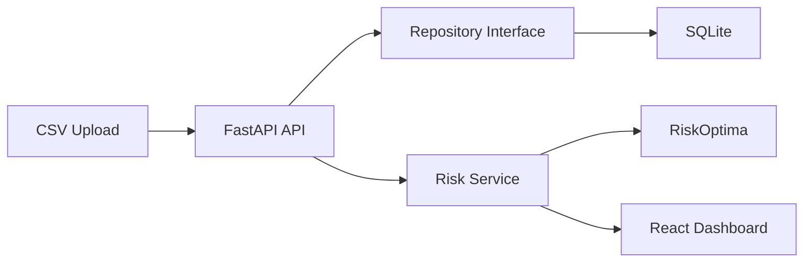

# RiskOptima Platform

Full-stack institutional portfolio risk platform powered by synthetic data and the [RiskOptima](https://github.com/JordiCorbilla/RiskOptima) Python package.

The platform demonstrates a production-style quant workflow: portfolio upload, deterministic synthetic market generation, portfolio risk reporting, VaR/CVaR, drawdown, volatility, beta, factor exposure, marginal VaR, component VaR, and stress testing.

## Screenshots

Desktop dashboard:


Mobile dashboard:


## Architecture

- Backend: Python FastAPI
- Analytics: pandas, numpy, scipy, scikit-learn, RiskOptima
- Frontend: React + TypeScript + Vite
- Database: SQLite via repository abstraction
- Charts: Recharts
- Tests: pytest and vitest



## Project Layout

```text
backend/app       FastAPI application, domain models, repositories, services
frontend/app      React TypeScript dashboard
sample_data       Synthetic CSV portfolios
docs              Architecture and API documentation
notebooks         Notebook walkthrough for analytics exploration
```

## Run Locally

Backend:

```powershell
cd backend
python -m venv .venv
.\.venv\Scripts\Activate.ps1
pip install -r requirements.txt
$env:PYTHONPATH = ".;C:\repo\portfolio_risk_kit"
uvicorn app.main:app --reload --port 8000
```

Frontend:

```powershell
cd frontend/app
npm install
npm run dev
```

Open `http://localhost:5173` and upload `sample_data/institutional_portfolio.csv`.

## Docker

```powershell
docker compose up --build
```

The API runs on `http://localhost:8000`; the containerized frontend is exposed on `http://localhost:8080`.

## API

- `POST /api/portfolios/upload`
- `GET /api/portfolios`
- `GET /api/portfolios/{id}/risk`
- `GET /api/portfolios/{id}/stress`
- `GET /api/scenarios`
- `POST /api/scenarios/run`

CSV uploads require `symbol`, `quantity`, and `price`. Optional fields include `name`, `asset_class`, `sector`, `currency`, and `beta`.

## Testing

Backend:

```powershell
cd backend
pytest
```

Frontend:

```powershell
cd frontend/app
npm test
```

## Notes

All analytics use synthetic data. This keeps the public repo deterministic, reproducible, and safe for demos without external market-data credentials.
