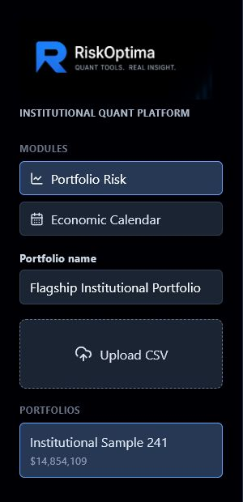
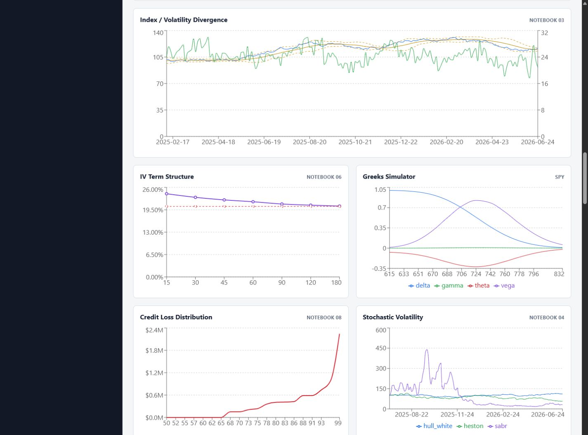
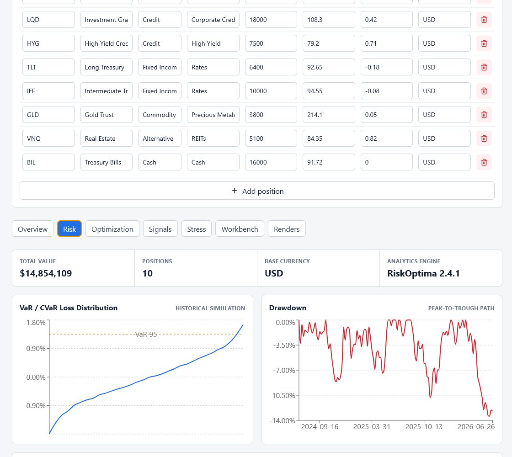
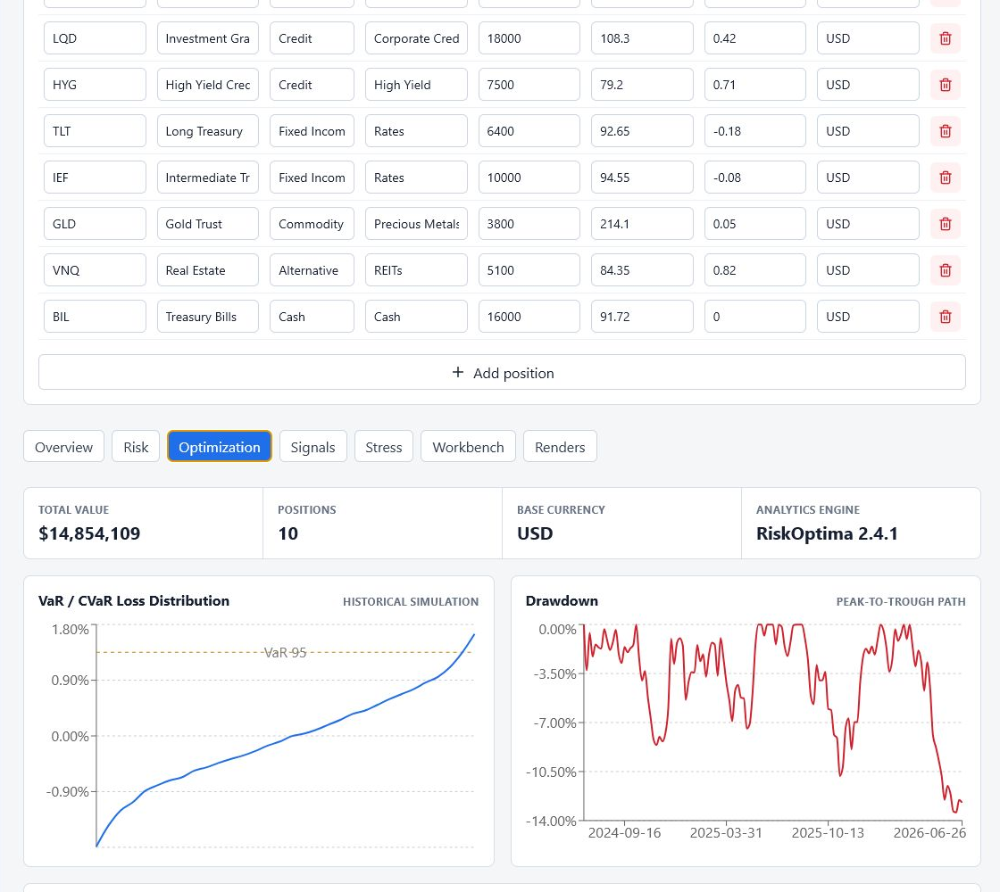
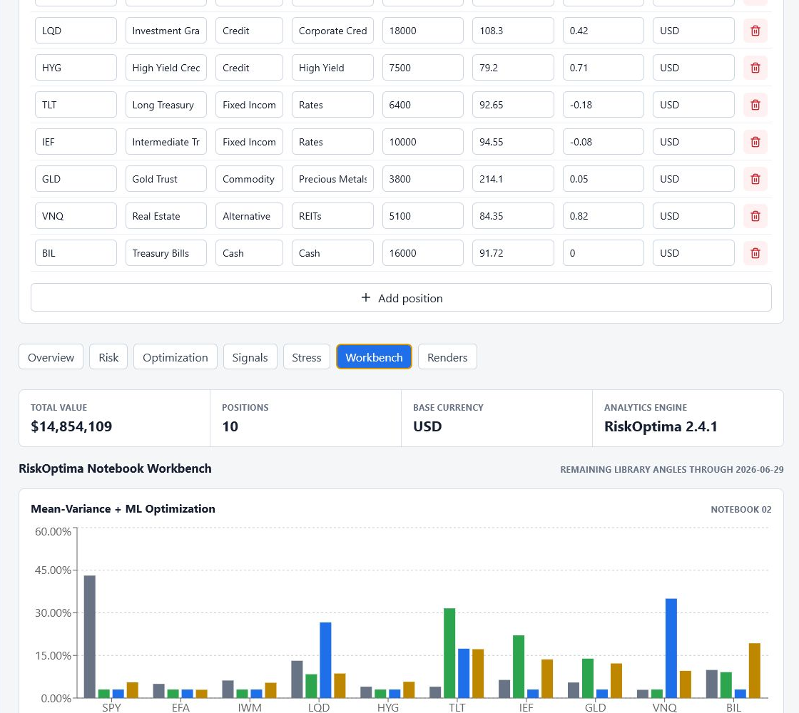
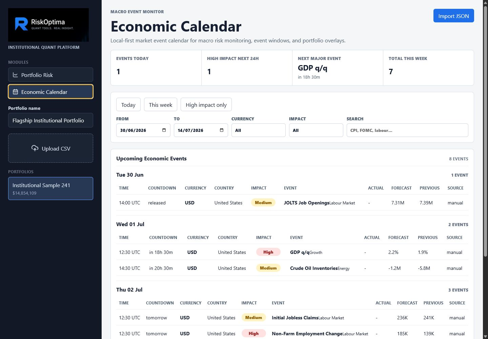
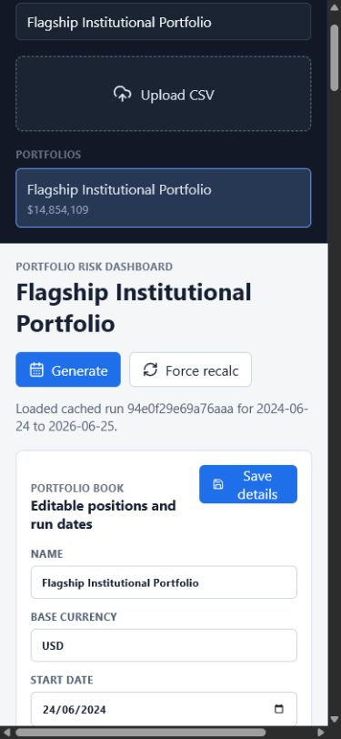
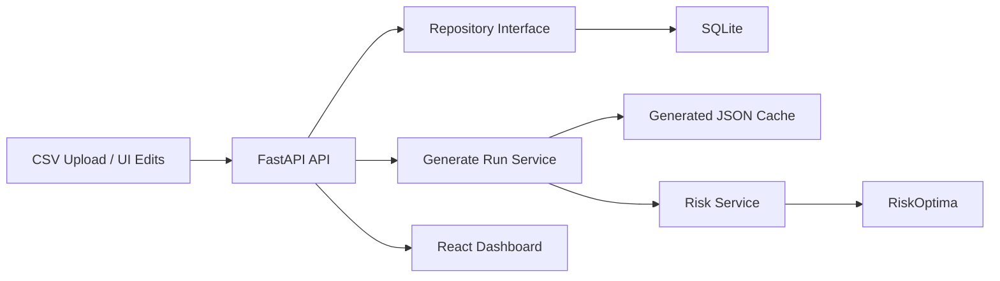

# RiskOptima Platform

<p align="center">
  
</p>

Full-stack institutional portfolio risk platform powered by synthetic data and the published [RiskOptima](https://pypi.org/project/riskoptima/) Python package.

The platform demonstrates a production-style quant workflow: editable portfolio books, deterministic synthetic market generation, dated portfolio risk runs, VaR/CVaR, drawdown, volatility, beta, factor exposure, marginal VaR, component VaR, RiskOptima efficient frontier analytics, SMA signal intelligence, notebook workbenches, per-instrument drilldowns, and stress testing.

## Screenshots

RiskOptima branded navigation:



Portfolio risk overview with the current RiskOptima 2.4.1 engine:



Risk dashboard in action:



Efficient frontier and allocation comparison:



RiskOptima notebook workbench:



Economic calendar module:



Mobile dashboard:



## Architecture

- Backend: Python FastAPI
- Analytics: pandas, numpy, scipy, scikit-learn, RiskOptima
- Frontend: React + TypeScript + Vite
- Database: SQLite via repository abstraction
- Generated run storage: deterministic JSON cache under `backend/generated_data`
- Charts: Recharts
- Tests: pytest and vitest



## Project Layout

```text
backend/app       FastAPI application, domain models, repositories, services
frontend/app      React TypeScript dashboard
sample_data       Synthetic CSV portfolios
docs              Architecture and API documentation
notebooks         Notebook walkthrough for analytics exploration
economic-calendar .NET 10 economic calendar module with React/Vite UI
```

## Run Locally

Backend:

```powershell
cd backend
py -3.11 -m venv .venv
.\.venv\Scripts\Activate.ps1
pip install -r requirements.txt
uvicorn app.main:app --reload --port 8000
```

The backend installs `riskoptima==2.4.1` from PyPI. For local RiskOptima library development only, set `RISKOPTIMA_PLATFORM_RISKOPTIMA_PATH` to a checkout path before starting FastAPI.

Frontend:

```powershell
cd frontend/app
npm install
npm run dev
```

The Economic Calendar is available from the main dashboard module menu. Run the .NET calendar backend on `http://127.0.0.1:5176`; the main Vite app proxies `/calendar-api` to it.

Open `http://localhost:5173` and either load a built-in sample portfolio from the sidebar or upload one of the CSV files in `sample_data`, such as `institutional_portfolio.csv` or `vanguard_multi_asset_portfolio.csv`. The UI lets you edit positions, save the portfolio definition, choose a start date and as-of date, generate a cached run, or force a recalculation.

The dashboard includes section tabs, portfolio validation, run-progress feedback, cached run history, and clickable instrument drilldowns for signal, VaR contribution, and stress-impact inspection.

The Workbench tab also surfaces RiskOptima 2.4.1 additions: Markov market-regime probabilities, portfolio sophistication method comparisons, and the volatility toolkit.

## Storage and Run Dates

Portfolio definitions are stored in SQLite at `backend/riskoptima_platform.db` by default. The repository interface keeps persistence isolated so PostgreSQL can be added later without changing the API or analytics services.

Generated analytics are stored separately in `backend/generated_data/portfolio_{id}/{run_id}`:

- `report.json`: risk metrics, factor exposure, VaR/CVaR, drawdown, contributors, stress results, and optimization payload.
- `charts.json`: rendered RiskOptima chart images as data URLs for the UI gallery.
- `metadata.json`: portfolio id, deterministic run id, start date, as-of date, generation timestamp, and RiskOptima package metadata.

The default as-of date is `T-1` business day. If today is Monday, the default run date is the previous Friday. If a weekend as-of date is submitted, the backend rolls it back to the previous Friday. The default start date is two years before the as-of date.

The run id is a hash of portfolio details, date range, platform engine version, and installed RiskOptima package version. Re-running the same book and dates loads the cache. Use **Force recalc** to refresh all calculations and charts after changing algorithms.

## Docker

```powershell
docker compose up --build
```

The API runs on `http://localhost:8000`; the containerized frontend is exposed on `http://localhost:8080`.

## API

- `POST /api/portfolios/upload`
- `GET /api/portfolios`
- `GET /api/portfolio-samples`
- `POST /api/portfolio-samples/{slug}/load`
- `GET /api/portfolios/{id}`
- `PUT /api/portfolios/{id}`
- `GET /api/portfolios/{id}/risk`
- `POST /api/portfolios/{id}/generate`
- `GET /api/portfolios/{id}/signals`
- `GET /api/portfolios/{id}/notebooks`
- `GET /api/portfolios/{id}/stress`
- `GET /api/scenarios`
- `POST /api/scenarios/run`

CSV uploads require `symbol`, `quantity`, and `price`. Optional fields include `name`, `asset_class`, `sector`, `currency`, and `beta`.

## Testing

Backend:

```powershell
cd backend
pytest
```

Frontend:

```powershell
cd frontend/app
npm test
```

## RiskOptima Integration

The efficient frontier and RiskOptima chart gallery call the RiskOptima package directly. The platform supplies synthetic price data into `plot_efficient_frontier_monte_carlo(..., price_data=..., return_output=True, save_data=False, save_plot=False)` so the UI receives structured frontier points and the rendered library chart without requiring live market downloads.

Risk reports include an `analytics_engine` payload with the RiskOptima package name, installed version, and import source. The dashboard displays the engine version so screenshots and cached artifacts clearly show which library release produced the run.

The signal workbench calls RiskOptima's SMA helpers and backtest engine:

- `build_sma_signal_frame`
- `trades_from_sma_signals`
- `SMACrossStrategy`
- `run_backtest`

Each generated portfolio run can be paired with a dated signal report so users can click a holding and inspect close price, SMA bands, buy/sell crossovers, trade history, win rate, drawdown, and strategy equity path.

## Notebook Coverage

Current platform coverage:

- `02-portfolio_optimization_riskoptima.ipynb`: correlation, area chart, efficient frontier, optimized weights, probability analysis.
- `05-portfolio_sma_strategy.ipynb`: SMA signal frames, trade logs, per-stock signal drilldowns, and portfolio SMA equity curve.
- `07-core_features_demo.ipynb`: reusable portfolio/risk/backtest primitives through the platform services.
- `03-index_vol_divergence_signals.ipynb`: synthetic index/VIX divergence event stream, exits, and return overlays using RiskOptima exit/return functions.
- `06-Options Trading Toolkit...ipynb`: synthetic IV term structure, Greeks simulator, and event straddle backtester.
- `08-credit_risk_model_demo.ipynb`: expected loss, credit VaR/CVaR, migration, and Merton PD views.
- `01-bond_analytics_riskoptima.ipynb`: cash-flow duration, modified duration, PVBP, and convexity drilldowns.
- `04-Stochastic_Volatility_Models_RiskOptima.ipynb`: Hull-White, Heston, and SABR scenario paths.

Yahoo-dependent notebook functions are represented with synthetic structured inputs so the public demo remains deterministic and credential-free.

## Notes

All analytics use synthetic data. This keeps the public repo deterministic, reproducible, and safe for demos without external market-data credentials.
