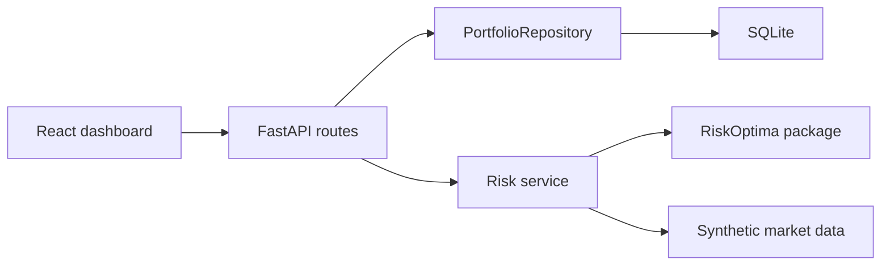

# Architecture

RiskOptima Platform is split into four explicit layers:

1. React + TypeScript dashboard for upload, monitoring, charts, and risk tables.
2. FastAPI REST API for portfolio ingestion, reports, and scenarios.
3. Domain and repository layer that persists portfolios to SQLite behind an interface.
4. Analytics layer that uses synthetic market data and RiskOptima market-risk/factor APIs.

The repository interface is deliberately small: save, list, and get portfolios. A PostgreSQL implementation can be added later without changing route handlers or risk services.

## Data Flow

1. A CSV portfolio is uploaded through `POST /api/portfolios/upload`.
2. Positions are validated into `Instrument` and `Position` domain models.
3. The portfolio is persisted as a JSON payload in SQLite.
4. Risk requests generate deterministic synthetic asset and factor returns.
5. RiskOptima calculates dashboard-ready market risk metrics.
6. The platform enriches the report with marginal VaR, component VaR, factor exposures, stress results, and chart-ready time series.

## Synthetic Data

The platform intentionally uses synthetic data only. The generator creates correlated factor returns and asset returns seeded by portfolio id, so reports are deterministic enough for demos and tests while still looking realistic.
