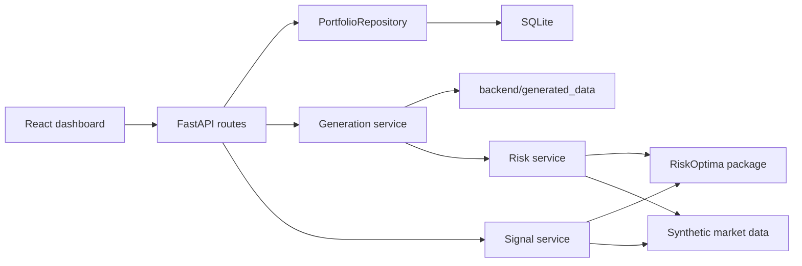

# Architecture

RiskOptima Platform is split into four explicit layers:

1. React + TypeScript dashboard for upload, portfolio editing, dated runs, charts, and risk tables.
2. FastAPI REST API for portfolio ingestion, reports, and scenarios.
3. Domain and repository layer that persists portfolios to SQLite behind an interface.
4. Generated-run cache that stores report/chart JSON by deterministic portfolio/date hash.
5. Analytics layer that uses synthetic market data and the published RiskOptima package's market-risk, factor, optimization, and signal/backtest APIs.

The repository interface is deliberately small: save, list, get, and update portfolios. A PostgreSQL implementation can be added later without changing route handlers or risk services.

## Data Flow

1. A CSV portfolio is uploaded through `POST /api/portfolios/upload` or edited in the UI.
2. Positions are validated into `Instrument` and `Position` domain models.
3. The portfolio is persisted as a JSON payload in SQLite.
4. The UI posts a date range to `POST /api/portfolios/{id}/generate`.
5. The generation service resolves the as-of date to a business day, defaulting to T-1 and rolling weekends to Friday.
6. If the portfolio/date/engine hash already exists, report and rendered chart JSON are loaded from `backend/generated_data`.
7. If cache is missing or force refresh is requested, risk requests generate deterministic synthetic asset and factor returns.
8. RiskOptima calculates dashboard-ready market risk metrics and efficient frontier output.
9. The platform enriches the report with marginal VaR, component VaR, factor exposures, stress results, chart-ready time series, and notebook-style rendered RiskOptima charts.
10. The signal service reuses the same dated synthetic prices to run RiskOptima SMA signal frames and the backtest engine for instrument drilldowns.

## Synthetic Data

The platform intentionally uses synthetic data only. The generator creates correlated factor returns and asset returns seeded by portfolio id, so reports are deterministic enough for demos and tests while still looking realistic.

## Generated Data Cache

Generated artifacts are kept outside SQLite because rendered chart payloads are large and can be regenerated. Each run writes:

- `report.json`
- `charts.json`
- `metadata.json`

The cache key includes the complete portfolio payload, the resolved start date, the resolved as-of date, the platform engine version, and the installed RiskOptima package version. Editing a position or upgrading RiskOptima naturally creates a new run id, while **Force recalc** overwrites an existing run folder for the same key.

Every risk report also carries an `analytics_engine` object containing the RiskOptima package name, installed version, and import source. This gives the UI and generated JSON artifacts an audit trail for which library release produced the analytics.

## Notebook Onboarding Map

The platform now covers all current RiskOptima notebook angles. The current UI deliberately treats holdings as clickable analytical objects: after a run, users can open an instrument and inspect RiskOptima SMA crossovers, completed trades, current state, volatility, drawdown, and portfolio strategy equity.

Additional notebook surfaces are exposed as a separate workbench rather than overloaded into the main risk report:

- volatility divergence signals
- options IV/Greeks/event strategy analytics
- credit risk and migration analytics
- fixed-income duration/convexity analytics
- stochastic volatility scenario models

The notebooks that rely on live Yahoo data are represented through deterministic synthetic data and structured payloads. That keeps the flagship demo reproducible while preserving the analytical intent of the library examples. Production and Docker installs use `riskoptima==2.4.1` from PyPI; local checkout overrides are reserved for library development.
